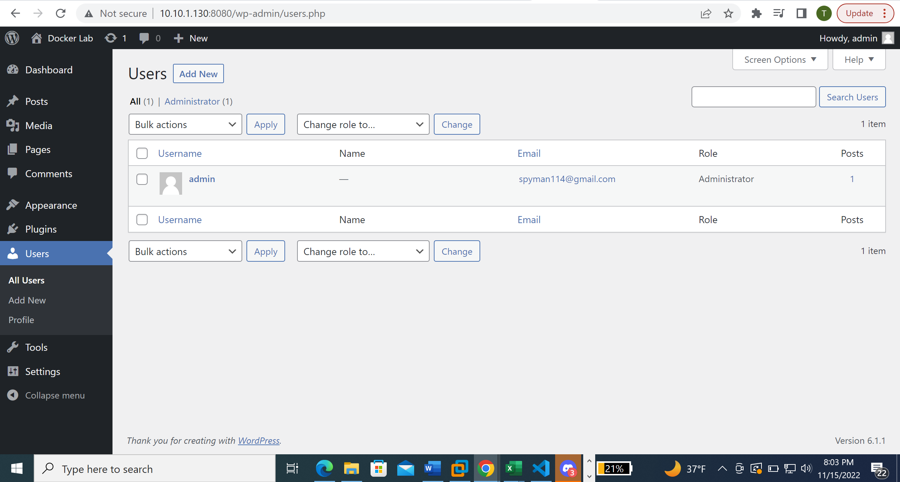

# Docker Lab

This was mainly accomplished with the help of Docker Hub:
<https://hub.docker.com/_/wordpress>

## Installing Docker

```bash
sudo apt install docker docker-compose
```

## Making A Directory For Wordpress

```bash
mkdir wordpress
ls 
#Just to make sure it was created
cd wordpress
touch docker-compose.yml
#creating docker-compose.yml to configure
```

## Embedding `docker-compose.yml`

```bash
nano docker-compose.yml
#This is where we paste the wordpress configuration
version: '3.1'

services:

  wordpress:
    image: wordpress
    restart: always
    ports:
      - 8080:80
    environment:
      WORDPRESS_DB_HOST: db
      WORDPRESS_DB_USER: exampleuser
      WORDPRESS_DB_PASSWORD: examplepass
      WORDPRESS_DB_NAME: exampledb
    volumes:
      - wordpress:/var/www/html

  db:
    image: mysql:5.7
    restart: always
    environment:
      MYSQL_DATABASE: exampledb
      MYSQL_USER: exampleuser
      MYSQL_PASSWORD: examplepass
      MYSQL_RANDOM_ROOT_PASSWORD: '1'
    volumes:
      - db:/var/lib/mysql

volumes:
  wordpress:
  db:
^X #This is to exit nano
Y #This confirms you want to save the changes
Enter #This exits the instance after the above inputs
```

## Booting Up Wordpress

```bash
docker-compose up -d
```

## Installing Wordpress

```
I went to my brower and put in my local host and ports used in the wordpress installation for the url: 10.10.1.130:8080 

This pulls up my Wordpress instance.

From here I selected my preferred language, input a site title (Docker Lab), username (admin), and password (34?sysAdmin). I then put my email into the email option just in case it was needed. I then completed the install.
```


